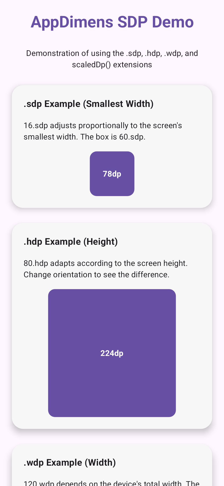
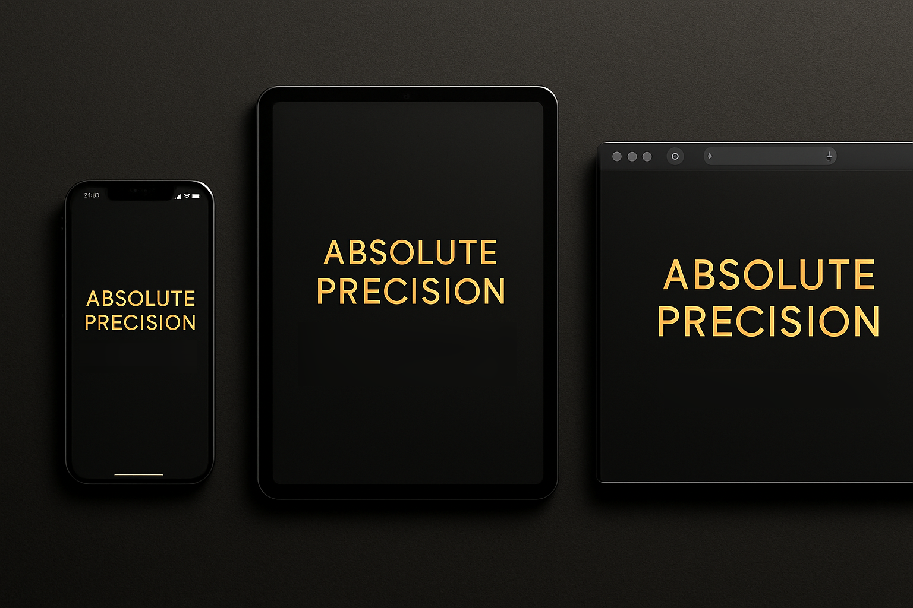

# AppDimens SDP, HDP, WDP


**AppDimens** is the most complete responsive dimension library for Android. It provides thousands of pre-calculated `@dimen` resources ready to use — plus dynamic Compose extensions, code-level APIs, conditional builders, orientation-aware inverters, and physical unit converters — all in a single, zero-configuration dependency.

---

## 🛠️ Installation

```kotlin
dependencies {
    implementation("io.github.bodenberg:appdimens-sdps:3.0.8")
}
```

**Requirements:** Min SDK 24 · Compile SDK 36 · Kotlin & Java · XML & Jetpack Compose

---

## 💻 Usage Examples

### 1. Jetpack Compose

**Basic — Auto-Scaling Extensions:**
```kotlin
import com.appdimens.sdps.compose.sdp
import com.appdimens.sdps.compose.hdp
import com.appdimens.sdps.compose.wdp

Box(
    modifier = Modifier
        .width(100.wdp)    // Scales relative to the device's width
        .height(100.hdp)   // Scales relative to the device's height
        .padding(16.sdp)   // Scales relative to the smallest width
) {
    Text("Hello World", fontSize = 14.sdp.value.sp) // Manual conversion
    Text("Scalable Text", fontSize = 16.ssp)       // Direct TextUnit extension
}
```

**Scalable Fonts (TextUnit) — Auto-Scaling Extensions:**
```kotlin
import com.appdimens.sdps.compose.ssp // Smallest Width
import com.appdimens.sdps.compose.hsp // Height
import com.appdimens.sdps.compose.wsp // Width
import com.appdimens.sdps.compose.sem // Without font scale (Smallest Width)

Text("Scalable", fontSize = 16.ssp)
Text("Height based", fontSize = 20.hsp)
Text("No font scale", fontSize = 16.sem)
```

**Inverter Shortcuts — Orientation-Aware Scaling:**
```kotlin
import com.appdimens.sdps.compose.sdpPh
import com.appdimens.sdps.compose.sdpLw
import com.appdimens.sdps.compose.hdpLw
import com.appdimens.sdps.compose.wdpLh

// .sdpPh → uses Smallest Width by default; in Portrait → switches to Height
val adaptiveVert = 32.sdpPh

// .sdpLw → uses Smallest Width by default; in Landscape → switches to Width
val adaptiveHorz = 32.sdpLw

// .hdpLw → uses Height by default; in Landscape → switches to Width
val heightToWidth = 50.hdpLw

// .wdpLh → uses Width by default; in Landscape → switches to Height
val widthToHeight = 50.wdpLh
```

**Facilitators — Quick Conditional Overrides:**
```kotlin
import com.appdimens.sdps.compose.sdpRotate
import com.appdimens.sdps.compose.sdpMode
import com.appdimens.sdps.compose.sdpQualifier
import com.appdimens.sdps.compose.sdpScreen

// Rotate: 80.sdp default, 50.sdp in Landscape
val rotVal = 80.sdpRotate(50)

// Mode: 30.sdp default, 200.sdp on TV
val modeVal = 30.sdpMode(200, UiModeType.TELEVISION)

// Qualifier: 60.sdp default, 120.sdp when sw ≥ 600dp
val qualVal = 60.sdpQualifier(120, DpQualifier.SMALL_WIDTH, 600)

// Screen: 70.sdp default, 150.sdp on TV with sw ≥ 600dp
val scrVal = 70.sdpScreen(150, UiModeType.TELEVISION, DpQualifier.SMALL_WIDTH, 600)

// Sp Facilitators (Returns TextUnit)
// .sspRotate, .hspRotate, .wspRotate, .sspMode, .sspQualifier, .sspScreen
val fontRot = 16.sspRotate(24)
val fontTV = 16.sspMode(40, UiModeType.TELEVISION)
```
```

**DimenScaled Builder — Complex Multi-Condition Chains:**
```kotlin
import com.appdimens.sdps.compose.scaledDp

val dynamicPadding = 16.scaledDp()
    // Priority 1: TV + sw ≥ 600 → 40
    .screen(UiModeType.TELEVISION, DpQualifier.SMALL_WIDTH, 600, 40)
    // Priority 2: Any TV → 32
    .screen(UiModeType.TELEVISION, 32)
    // Priority 2: Watch → 8
    .screen(UiModeType.WATCH, 8)
    // Priority 2: Foldable open → 24
    .screen(UiModeType.FOLD_OPEN, 24)
    // Priority 3: Any device with sw ≥ 600 → 20
    .screen(DpQualifier.SMALL_WIDTH, 600, 20)
    // Priority 4: Landscape → 12
    .screen(Orientation.LANDSCAPE, 12)
    .sdp // Resolve with Smallest Width adaptation

// ScaledSp Builder — Complex Font Chains (Returns TextUnit)
import com.appdimens.sdps.compose.scaledSp

val dynamicText = 16.scaledSp()
    .screen(UiModeType.TELEVISION, 40)
    .screen(Orientation.LANDSCAPE, 20)
    .ssp // Resolve to TextUnit

Box(modifier = Modifier.padding(dynamicPadding))
```

**Dynamic Inverters in DimenScaled:**
```kotlin
val adaptiveWidth = 300.scaledDp()
    .screen(
        type = DpQualifier.WIDTH, value = 600,
        orientation = Orientation.LANDSCAPE,
        customValue = 400.dp,
        inverter = Inverter.PW_TO_LH  // Width → Height on rotation
    )
    .wdp
```

### 2. XML Layouts

Use dimension resources directly — all values from `-300` to `600` are pre-generated:

```xml
<LinearLayout
    android:layout_width="match_parent"
    android:layout_height="wrap_content"
    android:padding="@dimen/_16sdp">

    <!-- SDP: Scales based on smallest width -->
    <TextView
        android:layout_width="wrap_content"
        android:layout_height="wrap_content"
        android:textSize="@dimen/_14sdp"
        android:layout_marginBottom="@dimen/_8sdp" />

    <!-- WDP: Scales based on screen width -->
    <View
        android:layout_width="@dimen/_200wdp"
        android:layout_height="@dimen/_50wdp" />

    <!-- HDP: Scales based on screen height -->
    <View
        android:layout_width="@dimen/_100hdp"
        android:layout_height="@dimen/_100hdp" />

    <!-- SDP: Scales based on smallest width -->
    <TextView
        android:textSize="@dimen/_16sdp" />
</LinearLayout>
```

### 3. Kotlin (Code Level)

```kotlin
// Core — Pixel values
val paddingPx = DimenSdp.sdp(context, 16)     // Smallest Width
val heightPx  = DimenSdp.hdp(context, 32)     // Height
val widthPx   = DimenSdp.wdp(context, 100)    // Width

// Scalable Sp - Pixel values
val fontSizePx = DimenSsp.ssp(context, 16)    // With font scaling
val fixedSpPx  = DimenSsp.sem(context, 16)    // Without font scaling

// Kotlin Extensions for Sp
import com.appdimens.sdps.code.ssp
import com.appdimens.sdps.code.hsp
import com.appdimens.sdps.code.scaledSp

val size = 16.ssp(context)
val adaptiveFont = 16.hsp(context)
val builderSp = 16.scaledSp().screen(UiModeType.TELEVISION, 40).ssp(context)

// Core — Resource IDs (for setTextSize, ViewGroup.LayoutParams, etc.)
val resId = DimenSdp.sdpRes(context, 16)

// Inverter shortcuts
val adaptive = DimenSdp.hdpLw(context, 50)    // Height → Width in Landscape

// Facilitators
val rotated = DimenSdp.sdpRotate(context, 30, 45)
val modeVal = DimenSdp.sdpMode(context, 30, 200, UiModeType.TELEVISION)
val qualVal = DimenSdp.sdpQualifier(context, 30, 80, DpQualifier.SMALL_WIDTH, 600)

// DimenScaled builder
val dynamicPx = DimenSdp.scaled(16)
    .screen(UiModeType.TELEVISION, 32)
    .screen(DpQualifier.SMALL_WIDTH, 600, 24)
    .screen(Orientation.LANDSCAPE, 12)
    .sdp(context)

// Physical units
val dpFromCm = DimenPhysicalUnits.toDpFromCm(2.5f, resources)
```

### 4. Java (Code Level)

```java
// Core
float paddingPx = DimenSdp.sdp(context, 16);
int resId = DimenSdp.sdpRes(context, 16);

// Scalable Sp
float fontSizePx = DimenSsp.ssp(context, 16);
int fontResId = DimenSsp.sspRes(context, 16);

// Inverter shortcuts
float adaptive = DimenSdp.hdpLw(context, 50);

// DimenScaled builder (uses @JvmStatic + @JvmOverloads)
DimenScaled scaled = DimenSdp.scaled(16)
    .screen(UiModeType.TELEVISION, 32)
    .screen(DpQualifier.SMALL_WIDTH, 600, 24)
    .screen(Orientation.LANDSCAPE, 12);

float result = scaled.sdp(context);
int resResult = scaled.sdpRes(context);
```

### 5. Physical Units

```kotlin
// Compose extensions
val widthMm = 10.mm       // 10mm → Dp
val widthCm = 2.5f.cm     // 2.5cm → Dp
val widthIn = 1.inch       // 1 inch → Dp

// Code level
DimenPhysicalUnits.toDpFromMm(25f, resources)
DimenPhysicalUnits.toDpFromCm(2.5f, resources)
DimenPhysicalUnits.toDpFromInch(1f, resources)
```

<br/>
<p align="center">
  
</p>
<br/>

---

## ✨ What's New in Version 3.x

| Feature | Description |
|---------|-------------|
| **Code-Level API** | Full `DimenSdp` object for Java & Kotlin — resolve dimensions outside of XML and Compose |
| **Inverter Shortcuts** | `.sdpPh`, `.sdpLw`, `.sdpLh`, `.sdpPw`, `.hdpLw`, `.hdpPw`, `.wdpLh`, `.wdpPh` — orientation-aware switching |
| **Facilitators** | `sdpRotate`, `sdpMode`, `sdpQualifier`, `sdpScreen` (+ hdp/wdp variants) — quick conditional overrides |
| **DimenScaled Builder** | Priority-based chain with `UiModeType`, `DpQualifier`, `Orientation`, and `Inverter` support |
| **Foldable Detection** | `FoldingFeature` integration via Jetpack WindowManager — detects Fold/Flip open/half-open states |
| **UiModeType** | `NORMAL`, `TELEVISION`, `CAR`, `WATCH`, `FOLD_OPEN`, `FOLD_HALF`, `FLIP_OPEN`, `FLIP_HALF` |
| **Physical Units** | `DimenPhysicalUnits` — convert mm, cm, inches to Dp/Px |
| **Sp & TextUnit** | Full support for Scalable Sp in Compose (`TextUnit`) and Code — respects or ignores font scale |
| **File Structure** | Modular files: `DimenSdp` (core), `DimenExtensions` (facilitators), `DimenScaled` (builder) |

---

## 🧮 Why Pre-Calculated Scales?

Most responsive Android solutions use runtime calculations to convert dimensions — multiplying density, screen metrics, or ratios on every frame or measure pass. **AppDimens takes a fundamentally different approach:**

### The Problem with Runtime Calculations

```kotlin
// ❌ Runtime calculation approach (common in other libraries)
fun scaledDp(value: Int): Float {
    val screenWidth = resources.displayMetrics.widthPixels
    val baseWidth = 360f // arbitrary "design" base
    return value * (screenWidth / baseWidth) // calculated EVERY call
}
```

This has several issues:
- **Calculated on every call** — no caching guarantee, wasted CPU cycles
- **Arbitrary base width** — the "360dp design base" is a guess that doesn't match all devices
- **Linear scaling only** — a simple ratio produces values that are either too large on tablets or too small on watches
- **No qualifier awareness** — ignores Android's built-in resource qualifier system (`values-sw600dp`, `values-h800dp`, etc.)

### The AppDimens Solution: Pre-Calculated + Qualifier-Aware

AppDimens provides **thousands of `@dimen` resources** generated with **mathematically refined, non-linear scaling curves** tuned for each qualifier bucket:

```
res/
├── values/           → Base values (phones ~320-360dp)
├── values-sw330dp/   → Slightly larger phones
├── values-sw360dp/   → Standard phones
├── values-sw410dp/   → Large phones
├── values-sw600dp/   → 7" tablets
├── values-sw720dp/   → 10" tablets
├── values-sw800dp/   → Large tablets / Chromebooks
├── values-h600dp/    → Height-based qualifiers
├── values-h800dp/    → Tall devices
├── values-w600dp/    → Width-based qualifiers
└── ...               → + qualifier directories
```

Each value is **pre-calculated with a refined mathematical formula** that produces dimensions tuned specifically for that screen category — not a simple linear ratio.

### Why This Matters

| Aspect | Runtime Calculation | AppDimens Pre-Calculated |
|--------|-------------------|-------------------------|
| **CPU Cost** | Calculated every call | Resolved at build time (zero runtime cost) |
| **Scaling Quality** | Linear ratio (imprecise) | Non-linear curves tuned per screen category |
| **Android Integration** | Bypasses the resource system | Uses native `@dimen` resources and qualifiers |
| **Caching** | Depends on implementation | Natively cached by Android Framework |
| **Orientation Handling** | Manual code required | Automatic via `-land`, `-port` qualifiers |
| **Predictability** | Values vary continuously | Discrete, designer-friendly values |

---

## ⚡ Performance

### XML: Zero Cost
All `@dimen/_16sdp` resources are **resolved statically at build time** by the Android resource system. There is literally no runtime overhead — it's the same mechanism Android uses for all `dimens.xml` values.

### Compose: Near-Zero Cost
The `.sdp`, `.hdp`, `.wdp` extensions use:
- `LocalConfiguration.current` — already observed by the Compose runtime
- `LocalContext.current.resources.getIdentifier()` — a single native lookup
- `dimensionResource()` — standard Compose resource resolution

No extra state, no custom `remember{}` overhead, no unnecessary recompositions. The dimension is resolved in the same pass as any standard Compose resource read.

### Code: Native Resolution
`DimenSdp.sdp(context, value)` performs a single `context.resources.getIdentifier()` + `getDimension()` call — the exact same path Android uses internally for any resource lookup.

---

## 📖 How It Works

### Three Scaling Axes

| Qualifier | Extension | Resource | Based On |
|-----------|-----------|----------|----------|
| **SDP** | `.sdp` | `@dimen/_16sdp` | `smallestScreenWidthDp` — the smaller of width/height, independent of orientation |
| **HDP** | `.hdp` | `@dimen/_16hdp` | `screenHeightDp` — the current screen height in dp |
| **WDP** | `.wdp` | `@dimen/_16wdp` | `screenWidthDp` — the current screen width in dp |

### Resource Naming Convention

```
_[minus]{value}{qualifier}dp

Examples:
  _16sdp      →  16dp scaled by Smallest Width
  _100wdp     →  100dp scaled by Width
  _50hdp      →  50dp scaled by Height
  _minus8sdp  →  -8dp (negative value)
```

Range: **-300 to 600** for all qualifiers.

### Conditional Dimension Resolution

The **DimenScaled** builder uses a priority system:

| Priority | Condition | Example |
|----------|-----------|---------|
| **1** (most specific) | `UiModeType` + `DpQualifier` + `Orientation` | TV with sw≥600 in Landscape |
| **2** | `UiModeType` + `Orientation` | Any TV device |
| **3** | `DpQualifier` + `Orientation` | sw≥600 regardless of device type |
| **4** (least specific) | `Orientation` only | Landscape orientation |

Higher-priority rules are checked first. Within the same priority, larger qualifier values are checked before smaller ones (e.g., sw720 before sw600).

### Inverter System

Inverters solve the problem of dimension semantics changing with rotation:

| Inverter | Behavior |
|----------|----------|
| `PH_TO_LW` | Portrait Height → Landscape Width |
| `PW_TO_LH` | Portrait Width → Landscape Height |
| `LH_TO_PW` | Landscape Height → Portrait Width |
| `LW_TO_PH` | Landscape Width → Portrait Height |
| `SW_TO_LH` | Smallest Width → Landscape Height |
| `SW_TO_LW` | Smallest Width → Landscape Width |
| `SW_TO_PH` | Smallest Width → Portrait Height |
| `SW_TO_PW` | Smallest Width → Portrait Width |

### UiModeType Detection

AppDimens detects the device form factor using Android's `Configuration.uiMode` combined with Jetpack WindowManager's `FoldingFeature`:

| Type | Detection |
|------|-----------|
| `NORMAL` | Standard phones and tablets |
| `TELEVISION` | Android TV / Leanback devices |
| `CAR` | Android Auto |
| `WATCH` | Wear OS |
| `FOLD_OPEN` | Foldable fully open (via `FoldingFeature.state == FLAT`) |
| `FOLD_HALF` | Foldable half-opened (via `FoldingFeature.state == HALF_OPENED`, horizontal hinge) |
| `FLIP_OPEN` | Flip phone fully open (via `FoldingFeature.state == FLAT`, vertical hinge) |
| `FLIP_HALF` | Flip phone half-opened (via `FoldingFeature.state == HALF_OPENED`, vertical hinge) |

---

## 🏆 Why AppDimens is More Complete

| Feature | AppDimens | intuit-sdp | sdp-android |
|---------|-----------|------------|-------------|
| SDP (Smallest Width) | ✅ | ✅ | ✅ |
| HDP (Height) | ✅ | ❌ | ❌ |
| WDP (Width) | ✅ | ❌ | ❌ |
| SSP (Scalable SP) | ✅ | ✅ (separate lib) | ❌ |
| Range | -300 to 600 | -60 to 600 | 1 to 600 |
| Negative values | ✅ | ✅ | ❌ |
| Compose extensions | ✅ `.sdp`, `.hdp`, `.wdp` | ❌ | ❌ |
| Code-level API (Kotlin/Java) | ✅ `DimenSdp` object | ❌ | ❌ |
| Orientation inverters | ✅ 8 inverter types | ❌ | ❌ |
| Conditional builder | ✅ `DimenScaled` | ❌ | ❌ |
| UiModeType detection | ✅ TV, Car, Watch, Foldable | ❌ | ❌ |
| Foldable device support | ✅ Fold/Flip + Half-Open | ❌ | ❌ |
| Physical units | ✅ mm, cm, inches | ❌ | ❌ |
| Facilitator functions | ✅ rotate, mode, qualifier, screen | ❌ | ❌ |
| Qualifier directories | 350+ | ~10 | ~10 |

---

## 🚀 Advantages

1. **Zero Configuration** — Works out of the box. No setup, no initialization, no base resolution to configure.
2. **Accelerated Development** — Eliminates the need to create massive manual `dimens.xml` files for every screen category.
3. **Triple Axis Scaling** — SDP + HDP + WDP cover every layout scenario, unlike single-axis alternatives.
4. **Hybrid Integration** — Works identically in XML, Jetpack Compose, and programmatic Kotlin/Java code.
5. **Device-Aware** — Built-in detection for TV, Car, Watch, Foldable, and Flip devices with automatic dimension adaptation.
6. **Pre-Calculated Precision** — Mathematically refined values tuned per screen category, not simple linear ratios.
7. **Zero Performance Impact** — All values resolved at build time via Android's native resource system.
8. **Full Range** — `-300` to `600` with negative value support for margins, offsets, and animations.



---

## 📏 Physical Units (DimenPhysicalUnits)

Beyond relative screen scaling, AppDimens provides direct conversion of **real physical measurement units** — ensuring absolute size regardless of device density.

| Method | Input | Output | Usage |
|--------|-------|--------|-------|
| `toDpFromMm` | Millimeters | Dp | `DimenPhysicalUnits.toDpFromMm(25f, resources)` |
| `toDpFromCm` | Centimeters | Dp | `DimenPhysicalUnits.toDpFromCm(2.5f, resources)` |
| `toDpFromInch` | Inches | Dp | `DimenPhysicalUnits.toDpFromInch(1f, resources)` |

Compose extensions: `10.mm`, `2.5f.cm`, `1.inch` → `Dp` values directly.

---

*Created with the best responsive layout practices for the Android ecosystem.*
